# Configuration Walkthrough

This document walks through the full configuration of the retail store network lab, device by device, with annotated screenshots taken directly from Cisco Packet Tracer.

## Topology

The store network is split into an **edge layer** (edge-R1 ↔ ISP), a **core L3 switch** (L3-SW1) that owns all inter-VLAN routing and DHCP, and two **access switches** (SW1, SW2) that connect the end devices.

---

## 1. VLAN Configuration

VLANs were created consistently across all three switches so that traffic stays segmented from the access layer all the way up to the core.

**L3-SW1 — VLAN table**
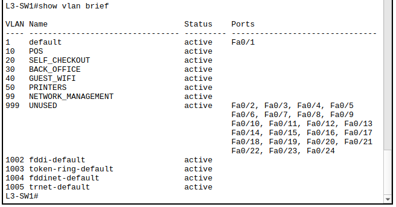

**SW1 — VLAN table**
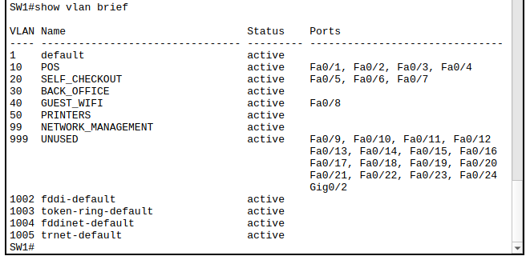

**SW2 — VLAN table**
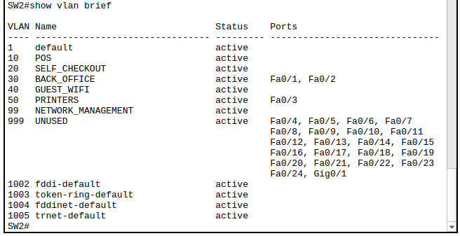

| VLAN | Name | Description |
|------|------|-------------|
| 10 | POS | Point-of-sale registers |
| 20 | SELF_CHECKOUT | Self-checkout kiosks |
| 30 | BACK_OFFICE | Manager & inventory PCs |
| 40 | GUEST_WIFI | Guest wireless access point |
| 50 | PRINTERS | Network printer(s) |
| 99 | NETWORK_MANAGEMENT | Switch/router management |
| 999 | UNUSED | Unused ports parking VLAN |

---

## 2. Access Layer — Port Security & Edge Protection

Every access port is hardened with **PortFast** (immediate forwarding, no STP delay) and **BPDU Guard** (shuts the port down if it receives a BPDU, protecting against rogue switches). Ports facing fixed, known devices additionally use **port security with sticky MAC** learning to lock the port to the first MAC address seen.

**SW1 — Fa0/1–Fa0/4, POS registers (VLAN 10, port security)**
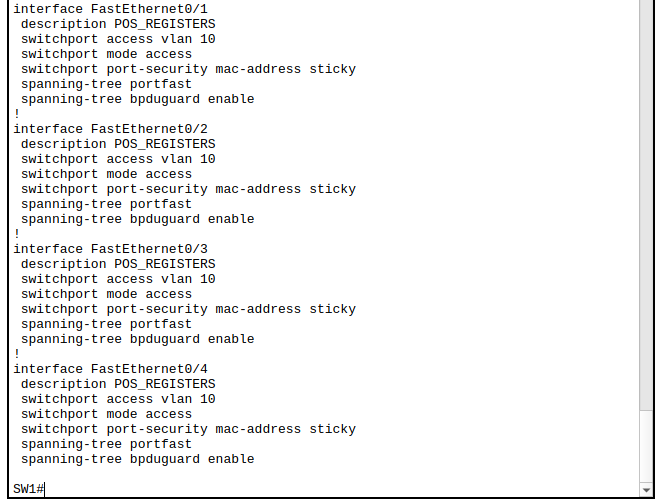

**SW1 — Fa0/5–Fa0/7, self-checkout kiosks (VLAN 20, port security)**
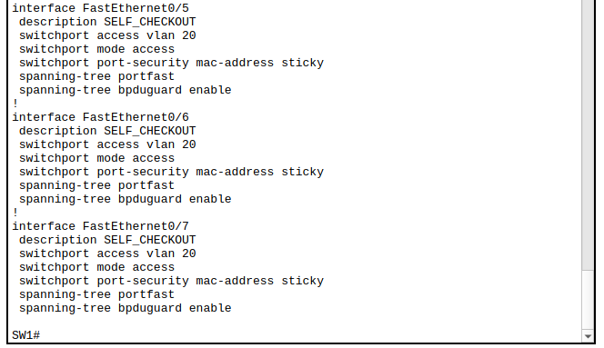

**SW1 — Fa0/8, guest Wi-Fi access point (VLAN 40)**
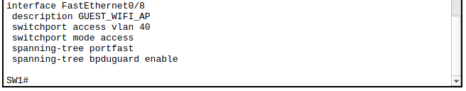

**SW2 — Fa0/1–Fa0/2, back office PCs (VLAN 30)**
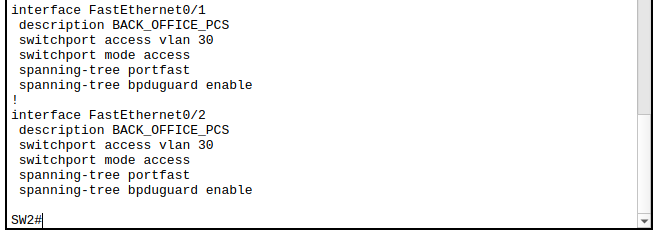

**SW2 — Fa0/3, network printer (VLAN 50)**
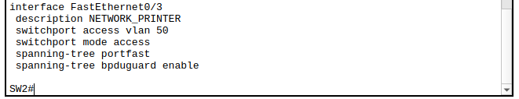

---

## 3. Trunk Links

SW1 and SW2 each trunk a single uplink back to the core (L3-SW1), carrying only the VLANs actually needed on that switch — nothing more.

**SW1 uplink trunk**
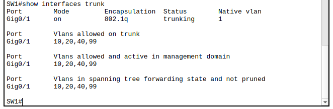

**SW2 uplink trunk**
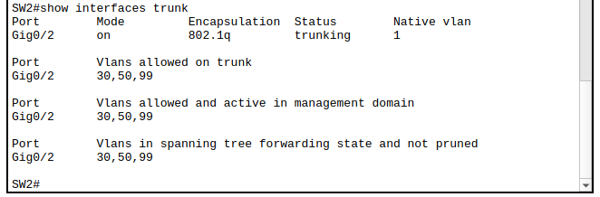

**L3-SW1 — both trunks (Gig0/1 to SW1, Gig0/2 to SW2)**
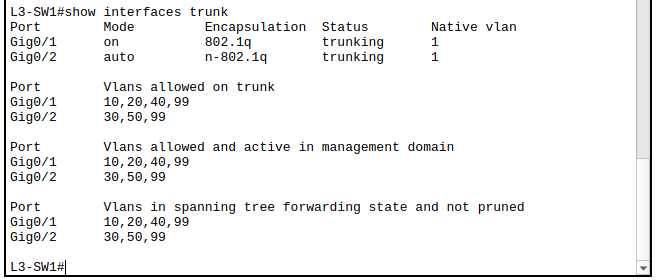

---

## 4. Layer 3 — SVIs & Inter-VLAN Routing

L3-SW1 hosts one SVI per VLAN, acting as the default gateway for every subnet in the store.

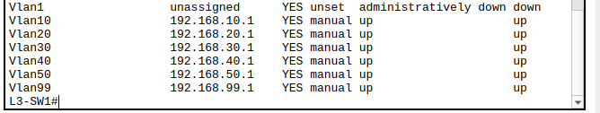

---

## 5. DHCP

L3-SW1 also runs DHCP for every internal VLAN, with the gateway address in each subnet excluded from the pool.

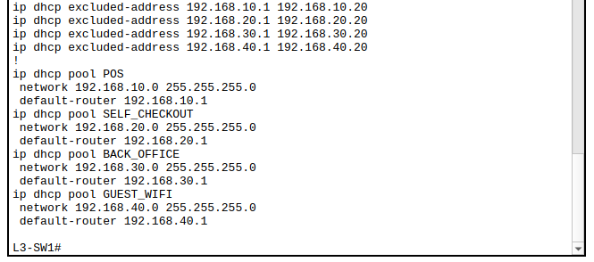

---

## 6. Switch Management

All three switches are managed out of a dedicated **VLAN 99 (NETWORK_MANAGEMENT)**, reachable only over **SSH** (Telnet is disabled on the VTY lines).

**SW1 — management SVI**
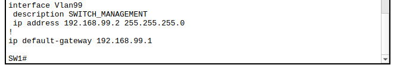

**SW2 — management SVI**
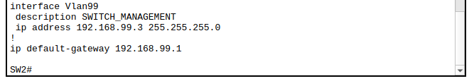

**SW1 — SSH-only VTY lines**
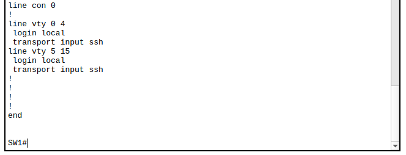

**SW2 — SSH-only VTY lines**

**L3-SW1 — SSH-only VTY lines**
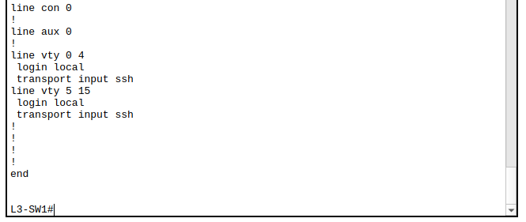

---

## 7. Core-to-Edge Link

L3-SW1 connects to edge-R1 over a dedicated, routed (non-switchport) point-to-point link.

**L3-SW1 — routed port to edge-R1**
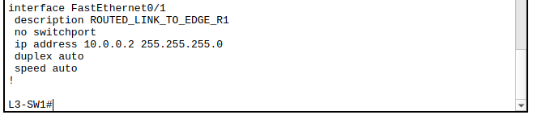

---

## 8. Edge Router (edge-R1)

edge-R1 sits between the store network and the ISP, translating all internal traffic via **NAT overload (PAT)** on its outside interface.

**Interfaces — Gi0/0 (to ISP, NAT outside) & Gi0/1 (to L3-SW1, NAT inside)**
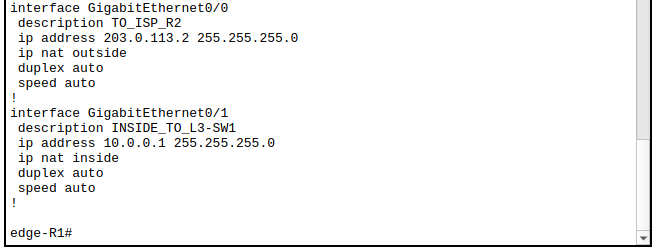

**NAT configuration — ACL matching internal 192.168.0.0/16 traffic, overloaded out Gi0/0**
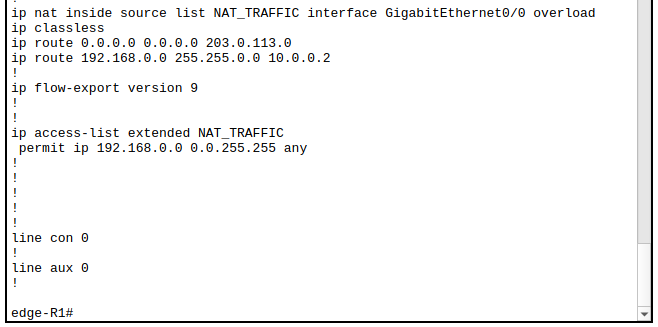

---

## 9. Routing

**edge-R1 — routing table** (default route to the ISP, static route back to the internal 192.168.0.0/16 range via L3-SW1)
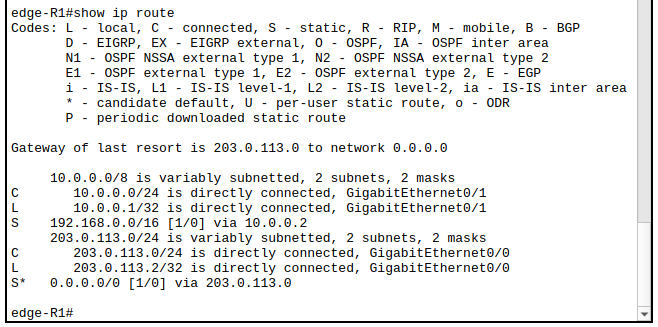

**L3-SW1 — routing table** (all VLANs directly connected, default route out to edge-R1)
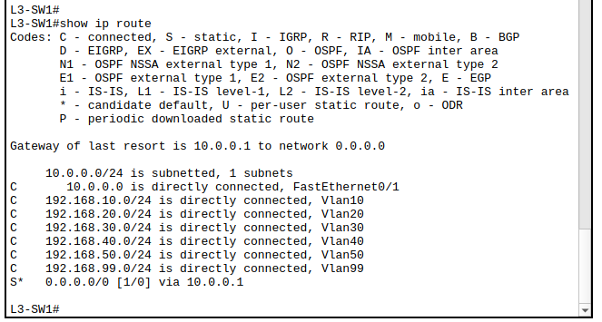

---

## Summary

| Layer | Device | Role |
|-------|--------|------|
| Edge | edge-R1 | NAT/PAT, default route to ISP, static route back to LAN |
| Core (L3) | L3-SW1 | Inter-VLAN routing, DHCP, SVIs, trunk aggregation |
| Access | SW1, SW2 | VLAN assignment, port security, PortFast/BPDU Guard, trunking to core |
| Management | VLAN 99 | SSH-only, out-of-band-style access to every switch |
