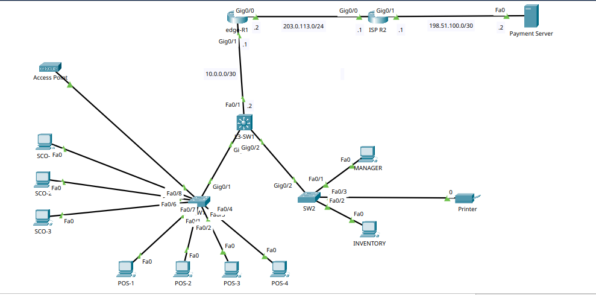

# Retail Store Network Lab — Cisco Packet Tracer

A simulated enterprise network for a small retail store, built in Cisco Packet Tracer. The design covers VLAN segmentation, Layer 3 inter-VLAN routing, DHCP, port security, trunking, SSH management, and NAT/PAT to an ISP for internet and payment-processor connectivity.

## 📐 Topology Overview



- **edge-R1** — Edge router connecting the store to the ISP, running NAT/PAT (overload) for internal-to-internet traffic.
- **ISP R2** — Upstream ISP router providing external connectivity to a Payment Server (representing a card-processing gateway).
- **L3-SW1** — Core Layer 3 switch. Owns the SVIs (VLAN interfaces) for every VLAN, performs inter-VLAN routing, and runs DHCP for all internal VLANs.
- **SW1 / SW2** — Access-layer Layer 2 switches, trunked back to the core, hosting end devices per VLAN.

## 🗂️ VLAN Design

| VLAN | Name                | Purpose                          | Subnet             |
|------|----------------------|-----------------------------------|---------------------|
| 10   | POS                  | Point-of-sale terminals           | 192.168.10.0/24     |
| 20   | SELF_CHECKOUT        | Self-checkout kiosks              | 192.168.20.0/24     |
| 30   | BACK_OFFICE          | Manager / inventory / office PCs  | 192.168.30.0/24     |
| 40   | GUEST_WIFI           | Guest wireless access point       | 192.168.40.0/24     |
| 50   | PRINTERS             | Network printers                  | 192.168.50.0/24     |
| 99   | NETWORK_MANAGEMENT   | Switch/router management (SSH)    | 192.168.99.0/24     |
| 999  | UNUSED               | Unused/shutdown ports parking lot | —                   |

## ✨ Key Features

- **Inter-VLAN routing** via SVIs on the L3 core switch (L3-SW1)
- **DHCP** served per VLAN from L3-SW1, with reserved/excluded ranges for infrastructure addresses
- **802.1Q trunking** between the core and both access switches, with only required VLANs permitted per trunk
- **Port security** (sticky MAC) on sensitive access ports (POS, self-checkout)
- **PortFast + BPDU Guard** on all access ports to speed up convergence and protect against rogue switches
- **Out-of-band-style management** via a dedicated VLAN 99, with SSH-only remote administration (Telnet disabled) on all switches
- **NAT overload (PAT)** on the edge router for internal VLANs to reach the internet/payment processor
- **Static routing** — a default route out to the ISP on edge-R1, a summarized static route back to the internal 192.168.0.0/16 space, and a default route on the core switch pointing to the edge router

## 📁 Repository Structure

```
configuration/
├── README.md      # Full configuration walkthrough with annotated screenshots
└── images/         # Packet Tracer screenshots (VLANs, trunks, DHCP, NAT, routing, etc.)
```

See [`configuration/README.md`](./configuration/README.md) for the full device-by-device configuration breakdown.

## 🛠️ Tools Used

- Cisco Packet Tracer

## 👤 Author

**Tohanur Islam**
